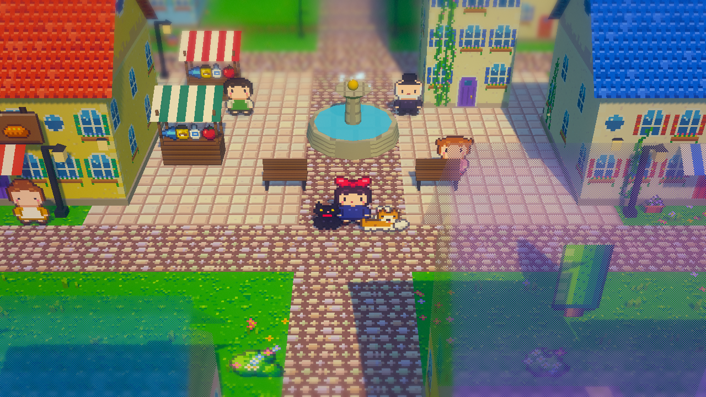
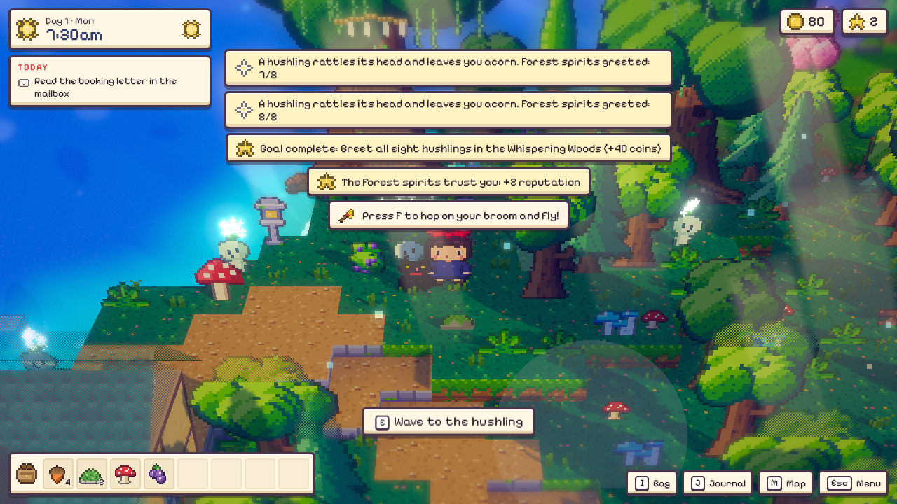
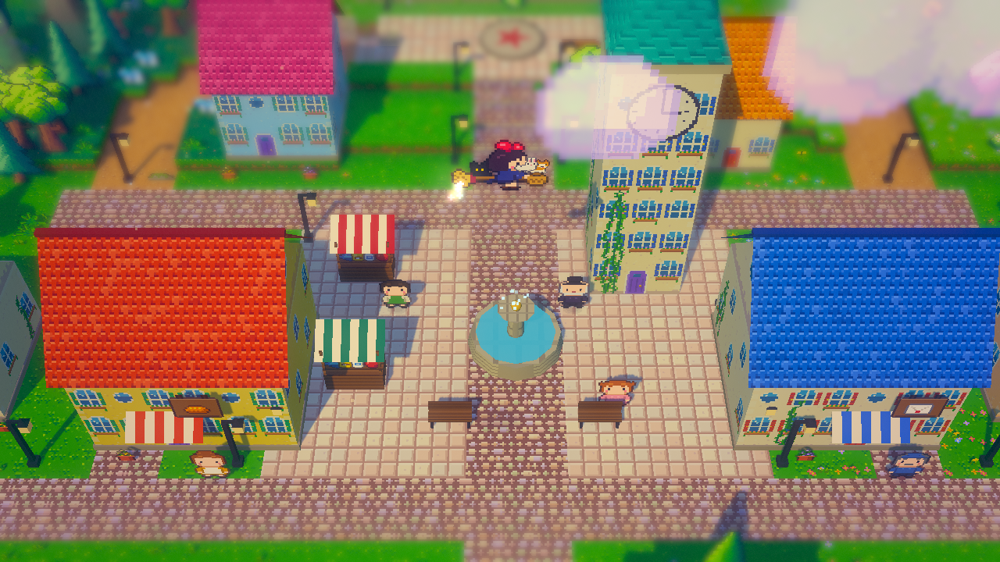
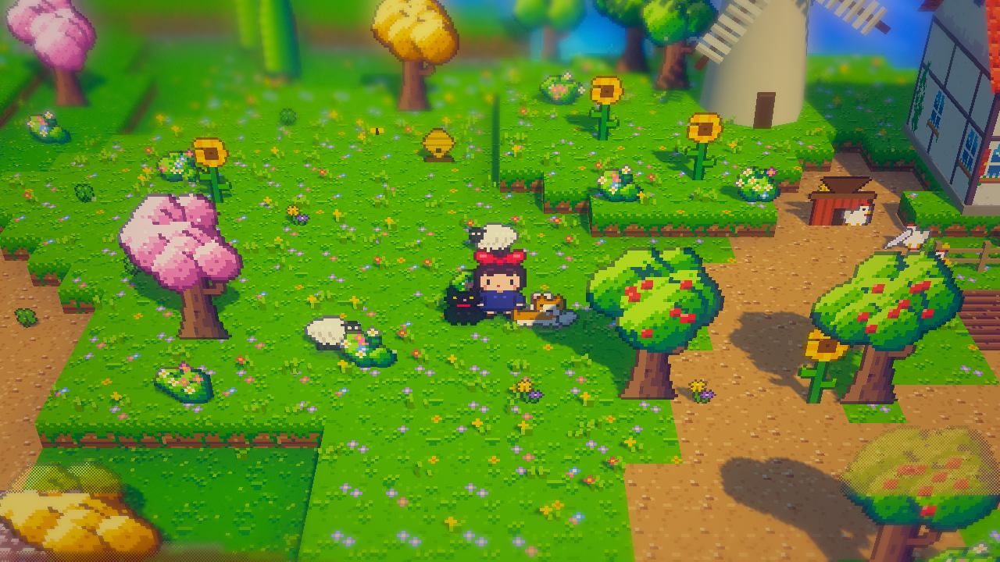
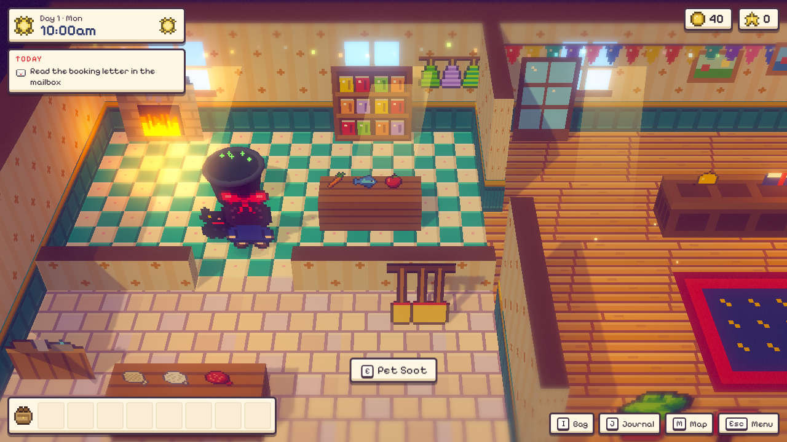
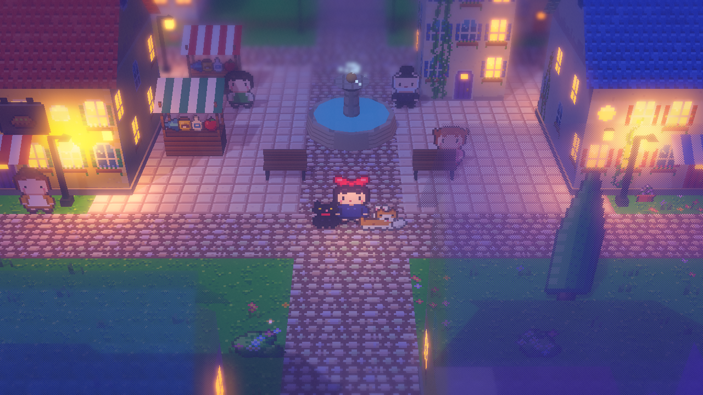
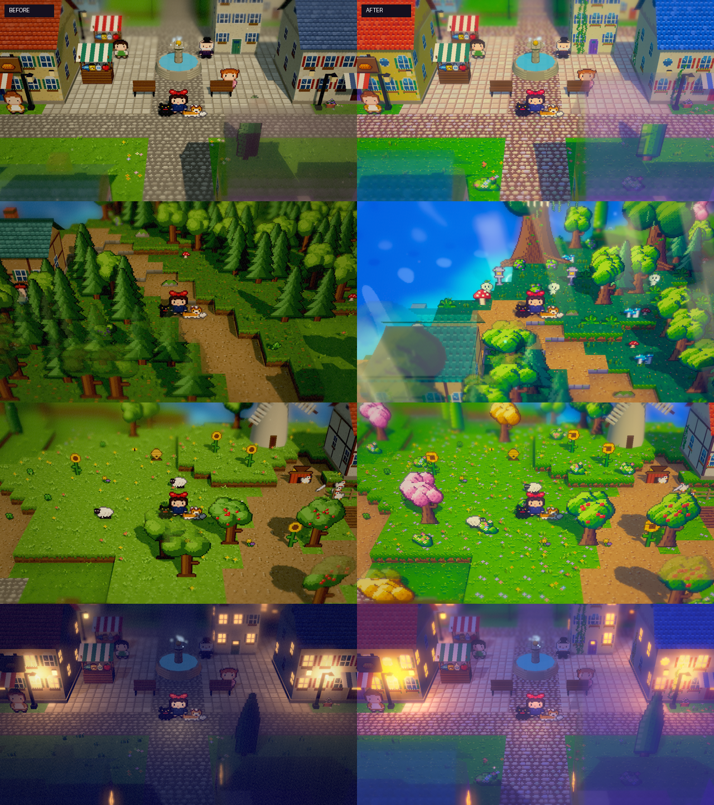

# Broom & Board

*A little witch's pet hotel by the sea.*

A cozy **HD-2D pixel-art** game for the browser. You play a young witch in her training year who has inherited
an old inn on the hill above **Maravik**, a sunny seaside town with candy-coloured roofs, a clock tower, a bakery
and a harbour full of boats. Beyond town, the **Whispering Woods** are an ancient forest of giant mossy trees,
glowing mushrooms and shy forest spirits. You turn the inn into **Broom & Board**, a hotel for pets.

The art direction is *Stardew Valley meets Princess Mononoke*: saturated, hue-shifted pixel art (violet
shadows, golden highlights), puffy storybook trees and flowers everywhere, and an old-growth forest with
light shafts, wisps and a sacred Spirit Tree.



| | |
| --- | --- |
|  |  |
|  |  |
|  |  |

## The loop

1. **Morning at the hotel.** Booking letters arrive in the mailbox. Accept the ones you have rooms for.
2. **Head out.** Press **F** to hop on your broom and fly over town.
   - **Collect** guests from their owners' doorsteps. They ride in your broom basket.
   - **Deliver** parcels for the Post Office and bread for the bakery. On foot, or drop them from the sky.
   - **Explore & forage.** Berries and mushrooms in the Whispering Woods, wool, honey and eggs at the farm,
     shells, sea glass and driftwood on the beaches. Catch feathers and nests in mid-air. On clear nights,
     **falling stars** land somewhere on the island.
   - **Befriend the hushlings.** Eight little forest spirits hide around the woods. Walk up and they rattle
     their heads. Greet them all to earn the forest's trust.
3. **Come home & sort your loot.** Empty your satchel onto the sorting table and drag each find into the
   Pantry, the Workshop or the Curio Cabinet. Wiggling bundles pop open into surprises.
4. **Take care of your hotel.**
   - Brew treats in the **cauldron** (recipes are taught by the townsfolk).
   - Craft **toys** and **room decor** at the workbench.
   - **Feed, pet, walk and play** with your guests. Grant each guest's **wish** (see their thought bubble).
   - Sweep up messes before the guests notice.
5. **Checkout.** On a guest's last day, fly them home. Happy pets mean tips and 5-star reviews.
   Reviews build **reputation**, which brings more bookings, new species (turtles, parrots, frogs, ferrets,
   owls, and one very royal poodle) and lets you renovate more rooms.
6. **Sleep** before 2am. A new day, new weather, new letters.

Also: gear upgrades at Fen's Flight Works (bigger satchel, bigger basket, faster broom), a lost balloon to
chase, a locked sea chest and a brass key, messages in bottles, a journal of goals, and a finale when the
hotel becomes the **Grand Broom & Board**.

## Controls

| Key | Action |
| --- | --- |
| **WASD** / arrows | Walk / fly |
| **Shift** | Run / boost |
| **E** / **Space** | Interact, talk, air-drop parcels |
| **F** | Hop on / off the broom |
| **I** · **J** · **M** | Bag · Journal · Map |
| **Esc** | Menu (settings, save) |

Touch devices get an on-screen joystick and buttons. The game autosaves every morning (browser local storage).

## Running it

```bash
npm install
npm run dev          # http://localhost:5173
npm run build        # static build in dist/
npm run build:single # one self-contained HTML file in dist-single/
```

## How it's made

Everything is generated in code, with no external art or audio files:

- **Pixel art** is authored as palette-indexed strings (`src/gfx/sprites.js`), then auto-outlined with
  darkened-neighbour "selective outlines". Terrain tiles, patterned wallpapers, fish-scale roofs, ivy, puffy
  clustered tree canopies, giant ancient trees and clouds are drawn procedurally from hue-shifted palettes
  (`src/gfx/tiles.js`, `src/gfx/sprites.js`).
- **HD-2D rendering** (`src/gfx/renderer.js`): the scene renders into an HDR target, then a depth-aware
  depth-of-field pyramid gives the tilt-shift diorama look. Bloom makes lanterns and windows glow, and a colour
  grade follows the time of day, with painterly split-toning (violet shadows, golden highlights), vibrance,
  a soft dreamy glow and a coloured vignette. Sprites are lit billboards that cast silhouette shadows. A
  dithered see-through circle and a foreground cut-away keep the witch visible behind roofs and trees.
- **Magic** (`src/gfx/glow.js`): a GPU glow field of drifting spirit wisps, luminous mushrooms, lantern halos,
  moonflowers and fairy lights; light shafts through the canopy, forest mist, falling blossom petals, an
  aurora on clear nights and a sparkle trail behind the broom.
- **World**: a hand-laid-out island (`src/world/island.js`) with terraces, auto-stair paths, a stylised
  shader sea with shore foam, a sky dome with stars, drifting clouds you fly between, and lamp light pools.
- **Music & sound** are synthesised with WebAudio (`src/core/audio.js`): an accordion waltz by day,
  a music-box lullaby at night, a brisk flying theme, plus ambience for wind, sea and rain.

Built with [three.js](https://threejs.org) and [Vite](https://vitejs.dev). Font:
[Pixelify Sans](https://fonts.google.com/specimen/Pixelify+Sans) (OFL).

*Art direction inspired by the warm seaside towns of classic hand-drawn animated films. All characters,
names and places are original.*
